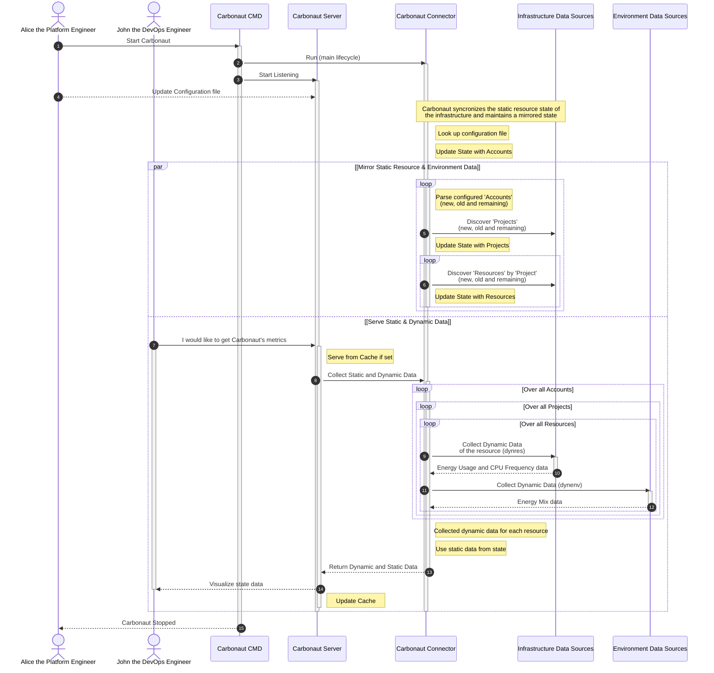
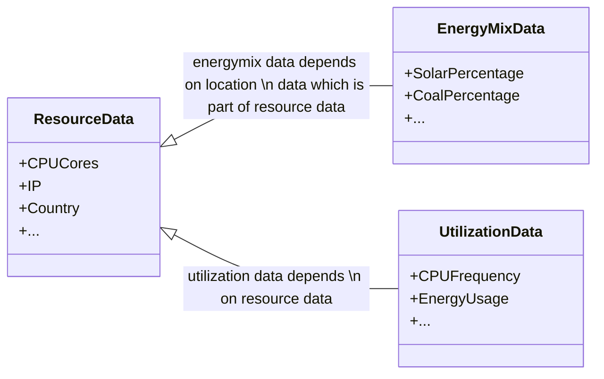

  

    

      Carbonaut's internal components are explained in this document. At a high level, Carbonaut serves metrics and integration functionallity over a server component which calls endpoints in the connector to collect metrics. The connector is the central component which controls the main application life cycle, it inhales the logic registering plugins and managing state. Plugins implement providers which deliver different kinds of data which is required to get the holistic overview of cloud native environmental sustainability.
    

  

  

    
  

<!-- The next sections will focus on each building block as well as the data schema. -->

### Server

The Carbonaut Server hosts an HTTP server which serves collected metrics and serves an access point to configure the deployment at runtime. Detailed information can be found in the [api documentation](/docs/reference/server-api/). As of now the server exposes metrics in `json` format. These metrics could be mapped to [prometheus metric types](https://prometheus.io/docs/concepts/metric_types/) down the road for better integration in the cloud native ecosystem.

### Connector

At a higher level, Carbonaut integrates data over providers, and exposes collected data over a server (see [Server API docs](/docs/reference/server-api/)). Between these two components is the **Connector** component which contains the main lifecycle of the system.

#### Internal Runtime

The connector, parses the configuration, starts and stopps plugins, updates the local state which contains the topology of the IT infrastructure and collects data from all connected providers which the API server exposes in different formats. A simplified version of the runtime is visualized below.

#### Carbonaut Internal State

Carbonaut maintains an internal state which includes data which does not change until a resource was destroyed. Information about how much CPU cores or which Chip Architecture is considered static resource information. Information about the geolocation which indicate where the resource is hosted is considered static environment information. The data schema is defined [here](/docs/reference/schema/#type-staticresdata).

### Provider & Plugins

Carbonaut collects data of your infrastructure over data providers. Providers are interfaces which are implemented as plugins (see Plugin section in the sidebar). There are three different kinds of providers:

- `Dynamic Environment Provider` collects data about the Energy Mix (may be extended).
- `Dynamic Resource Provider` collects data about Energy Usage, CPU Frequency etc. (may be extended).
- `Static Resource Provider` collects data about CPU, Memory, IP etc. and also data about the geolocation and region of the IT resource.

These providers depend on each other. To collect energy usage of a system you first need to be aware of the system's topology. In the cloud environment we have heterogenous systems which changes dynamically. Therefore Resources are captured in projects (like K8s namespace's) and accounts (like K8s cluster's). The static resource provider just references the account and further discovery of projects and resources are done at runtime.

Providers expose interfaces which are defined in the schema reference document. The [`dynenv` provider](/docs/reference/schema/#type-provider) integrates [data](/docs/reference/schema/#type-dynamicenvdata) about the energy mix. The [`dynres` provider](/docs/reference/schema/#type-provider-1) integrates [data](/docs/reference/schema/#type-dynamicresdata) umong other things about energy usage. The [`staticres` provider](/docs/reference/schema/#type-provider-2) integrates [data](/docs/reference/schema/#type-staticresdata) umong other things about Operating System, Memory, Region.
